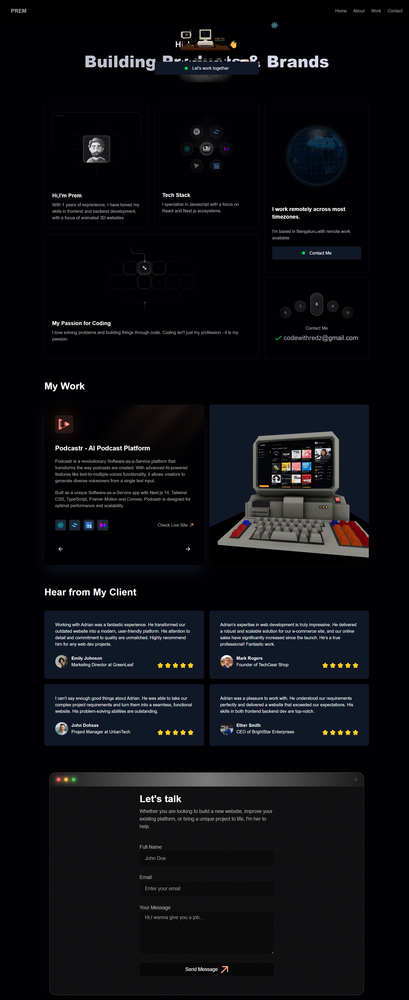

# 🌟 3D Portfolio

A stunning, interactive 3D portfolio website built with React, Three.js, and Framer Motion. This portfolio showcases immersive web experiences with smooth animations and modern design.



## ✨ Features

- 🎨 **Immersive 3D Graphics** - Interactive 3D elements powered by Three.js
- 🎭 **Smooth Animations** - Fluid transitions using Framer Motion
- 📱 **Fully Responsive** - Optimized for all devices and screen sizes
- ⚡ **Performance Optimized** - Fast loading and smooth interactions
- 🎯 **Modern UI/UX** - Clean, intuitive, and engaging user interface
- 📄 **Downloadable CV** - Easy access to resume/CV
- 🌈 **Dynamic Theming** - Beautiful color schemes and visual effects

## 🚀 Technologies Used

- **React** - UI library for building component-based interfaces
- **Three.js** - JavaScript 3D library for creating WebGL graphics
- **Framer Motion** - Animation library for React
- **Bootstrap** - CSS framework for responsive design
- **React Router** - Navigation and routing
- **CSS3** - Modern styling and animations

## 📦 Installation

1. **Clone the repository**
   ```bash
   git clone https://github.com/Premkumar-collab/3d-Portfolio.git
   ```

2. **Navigate to project directory**
   ```bash
   cd 3d-Portfolio
   ```

3. **Install dependencies**
   ```bash
   npm install
   ```

4. **Start the development server**
   ```bash
   npm start
   ```

5. **Open your browser**
   ```
   Navigate to http://localhost:3000
   ```

## 🛠️ Build for Production

Create an optimized production build:

```bash
npm run build
```

The build folder will contain the optimized files ready for deployment.

## 📁 Project Structure

```
3d-Portfolio/
├── public/
│   ├── cv.pdf              # Your CV/Resume file
│   └── index.html
├── src/
│   ├── components/         # React components
│   ├── assets/            # Images, icons, 3D models
│   ├── styles/            # CSS files
│   ├── App.js             # Main App component
│   └── index.js           # Entry point
├── package.json
└── README.md
```

## 🎯 Key Sections

- **Hero Section** - Eye-catching introduction with 3D elements
- **About** - Personal introduction and background
- **Skills** - Technical skills and expertise showcase
- **Projects** - Portfolio of completed works
- **Contact** - Get in touch form and social links


## 🌐 Deployment

### Deploy to GitHub Pages

1. Install gh-pages:
   ```bash
   npm install --save-dev gh-pages
   ```

2. Add to `package.json`:
   ```json
   "homepage": "https://Premkumar-collab.github.io/3d-Portfolio",
   "scripts": {
     "predeploy": "npm run build",
     "deploy": "gh-pages -d build"
   }
   ```

3. Deploy:
   ```bash
   npm run deploy
   ```

### Deploy to Vercel

1. Install Vercel CLI:
   ```bash
   npm install -g vercel
   ```

2. Deploy:
   ```bash
   vercel
   ```

### Deploy to Netlify

1. Build the project:
   ```bash
   npm run build
   ```

2. Drag and drop the `build` folder to [Netlify](https://app.netlify.com/)

## 📝 License

This project is open source and available under the [MIT License](LICENSE).

## 👤 Author

**Premkumar**

- GitHub: [@Premkumar-collab](https://github.com/Premkumar-collab)
- Portfolio: [Your Portfolio Link]

## 🤝 Contributing

Contributions, issues, and feature requests are welcome!

1. Fork the project
2. Create your feature branch (`git checkout -b feature/AmazingFeature`)
3. Commit your changes (`git commit -m 'Add some AmazingFeature'`)
4. Push to the branch (`git push origin feature/AmazingFeature`)
5. Open a Pull Request

## ⭐ Show Your Support

Give a ⭐️ if you like this project!

## 📞 Contact

Feel free to reach out for collaborations or just a friendly chat:

- Email: codewithredz@gmail.com

---

Made with ❤️ and React
